# Payroll Data Pipeline

This project demonstrates a modern data pipeline for automating the extraction, transformation, and loading (ETL) of payroll and HR data. The pipeline centralizes payroll data, enabling efficient processing, compliance, and analytics to support HR and finance operations.

## Table of Contents
- [Payroll Data Pipeline](#payroll-data-pipeline)
  - [Table of Contents](#table-of-contents)
  - [Architecture](#architecture)
  - [Project Structure](#project-structure)
  - [Data Source](#data-source)
  - [Quickstart](#quickstart)
    - [Clone the repository](#clone-the-repository)
    - [Setup virtual environment](#setup-virtual-environment)
    - [Start services](#start-services)
  - [Tech Stack](#tech-stack)
    - [Apache Airflow](#apache-airflow)
    - [Amazon S3](#amazon-s3)
    - [DuckDB](#duckdb)
    - [Snowflake](#snowflake)
    - [dbt \& Great Expectations](#dbt--great-expectations)
    - [PowerBI](#powerbi)
  - [Business Insights](#business-insights)
    - [Payroll Overview](#payroll-overview)
    - [Recommendations](#recommendations)

## Architecture

This payroll data pipeline adopts a modular and maintainable structure with the following components:

<p align="center">
    
    </br>
  Project Architecture
</p>

1. **Data Source (Google Drive)**  
   - Raw sales and payment data are shared as 16 CSV files in a common folder on Google Drive.

2. **Ingestion Layer (Airflow)**  
   - Airflow downloads the CSV files from Google Drive and stores them in the `raw/` folder on Amazon S3.

3. **Lightweight Transformation Layer (DuckDB)**
   - DuckDB performs type casting and renaming on raw data.
   - Resulting files are saved to `processed/` in S3.

4. **Distributed Transformation & Load Layer (Apache Spark)**
   - Spark handles large-scale data transformation (joins, filters).
   - Output is written to Snowflake’s `landing` schema.

5. **Modeling Layer (dbt - `dbt_payroll`)**

The `dbt_payroll` project is structured to follow best practices, organized into several core folders:

- **`models/`**:
  - `landing/`: Contains raw tables ingested from Spark jobs and loaded into Snowflake.
  - `staging/`: Applies standardized naming, typing, and light business rules.
  - `intermediate/`: Joins and enriches staging models for downstream use.
  - `marts/`: Contains curated models:
    - `dim/`: Dimension tables for reporting
    - `fact/`: Fact tables for KPIs and aggregations
      

| Layer          | Purpose                          | Models |
|----------------|----------------------------------|--------|
| `landing`      | Raw data after Spark transformation | `lnd_allowance`, `lnd_bonus`, `lnd_combined_holidays`, `lnd_contract_details`, `lnd_dim_pay_period`, `lnd_employee_details`, `lnd_employee_leave`, `lnd_junior_pay_rates`, `lnd_past_payslips`, `lnd_minimum_pay_rates`, `lnd_pay_rate_adjustments`, `lnd_roster`, `lnd_super_guarantee_rates_formatted`, `lnd_tax_rates`, `lnd_time_off_in_lieu`, `lnd_timesheet` |
| `staging`      | Cleaned, typed, renamed fields   | `stg_customers`, `stg_order_items`, `stg_order_payment`, `stg_order_reviews`, `stg_orders`, `stg_product_category_name_translation`, `stg_products`, `stg_sellers` |
| `intermediate` | Joins & enrichments              | `int_order_item_joined` |
| `marts - dim`  | Dimension tables                 | `dim_customers`, `dim_products`, `dim_sellers`, `dim_products_category_name_translation` |
| `marts - fact` | Fact tables                      | `fact_orders_items`, `fact_order_payments`, `fact_order_reviews` |


- **`seeds/`**: Stores static reference data from 01 Jan 2016 to 31 Dec 2019 stored in `dim_dates.csv` file.

- **`snapshots/`**: Tracks historical changes in selected tables using Slowly Changing Dimension (SCD) Type 2 logic  
  Useful for maintaining audit trails of evolving records.
Files used in this project: `scd_customers.sql`, `scd_products.sql`, `scd_sellers.sql`.   

- **`macros/`**: Contains reusable SQL logic written in Jinja to reduce duplication and enforce consistency.

- **`tests/`**: Houses both built-in and custom dbt tests to validate data integrity (e.g., uniqueness, nulls, foreign key relationships).

- **`targets/`**: Stores compiled outputs and metadata from dbt runs (automatically managed).

6. **Validation Layer (Great Expectations)**  
   - Data quality checks are performed throughout the pipeline to validate schema, null values, uniqueness, and referential integrity.

7. **Reporting Layer (Power BI)**  
   - Cleaned and modeled data from Snowflake is visualized in Power BI dashboards for business stakeholders.

## Why This Architecture?

Several issues were encountered before using this architecture in the payroll system:

- Manual data uploads from business users
- Inconsistent data formatting from the source
- Lack of early-stage validation and schema enforcement
- Complex transformation logic tightly coupled with reporting tools

This architecture resolves those issues by offering:

- **Automated ingestion** from Google Drive via Airflow
- **Light, schema-first transformation** using DuckDB before Snowflake loading
- **Layered, modular modeling** with dbt for clarity and reusability
- **Early validation and testing** using Great Expectations
- **Centralized and scalable reporting** with Power BI on top of Snowflake

The result is a robust, production-ready pipeline that is transparent, testable, and easily extensible.

## Project Structure
```shell
.
├── airflow/                /* Airflow folder, contains DAGs and scripts */
├── assets/                 /* Assets folder, contains diagrams, dashboards, etc. */
├── dbt_payroll/            /* dbt project folder, contains dbt models */
├── docker/                 /* Docker services configuration folder */
│   ├── airflow/               /* Airflow orchestrator configurations */
│   ├── spark-app              /* Spark container for transformation logic */
│   ├── spark-master           /* Spark container for distributing workloads */
│   ├── spark-worker           /* Spark container for code execution */
├── .gitignore
├── .python-version
├── uv.lock
├── README.md
├── snowflake-setup.md      /* Instructions to setup Snowflake beforehand */
├── pyproject.toml          /* Project dependencies, run uv sync in virtual environment */
├── docker-compose.yaml     /* Docker Compose file to define services */
└── Makefile                /* Makefile for automating tasks and commands */
```

## Data Source

The payroll datasets include employee records, salary details, attendance logs, tax deductions, and benefits information. These are typically exported from HR/payroll systems and ingested into the pipeline for processing and analytics.

<p align="center">
    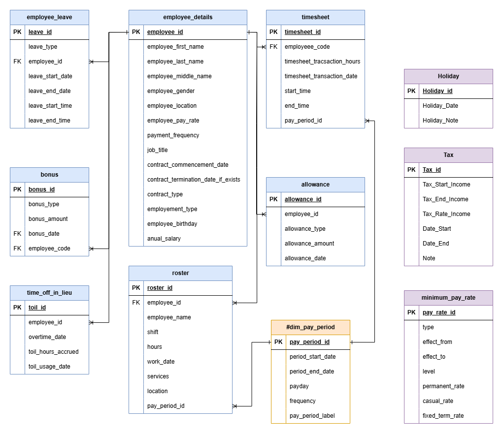
    </br>
  Source Relational Model
</p>

## Quickstart

> **Prerequisites:**
> - **Git** for version control.
> - **uv** or **Conda/Mamba** for virtual environment management.
> - **Docker** for containerization.
> - **Makefile** (optional) for automating Docker commands.

### Clone the repository
```shell
git clone https://github.com/PhoenixPhungNguyen/payroll_data_pipeline.git
```

### Setup virtual environment

- Create and activate virtual environment:
  ```shell
  uv venv --python 3.11
  source .venv/bin/activate   # or .venv/Scripts/activate on Windows
  ```
- Initialize project and install packages:
  ```shell
  uv init
  uv add dbt-core dbt_snowflake ipykernel duckdb boto3 pyspark==3.3.0 pymupdf apache-airflow
  uv sync
  ```
  
### Start services

- Create a `.env` file at the root level for environment variables (see `.env.example`).
- Ensure any required data files are placed in the appropriate folders as described in the documentation.
- Make sure to add .env, .venv/, and other sensitive files to .gitignore.
- Configuring environment variables: Copy .env.example to .env and fill in:
  Google API Key and Google drive folder ID
  Slack tokens
  AWS access keys
  Snowflake credentials
  
To start all services:
```shell
make up
```
Or, without Makefile:
```shell
docker compose up -d --build
```

## Tech Stack
### Google Cloud Platform (GCP)

- Create API key in API & Services.
<p align="center">
    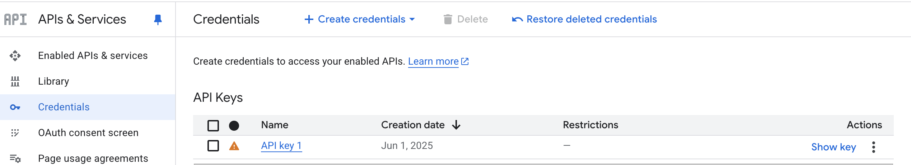
    </br>
</p>

- Share payroll folder which contains 16 CSV files to ingest data from this folder to Amazon S3
  
<p align="center">
    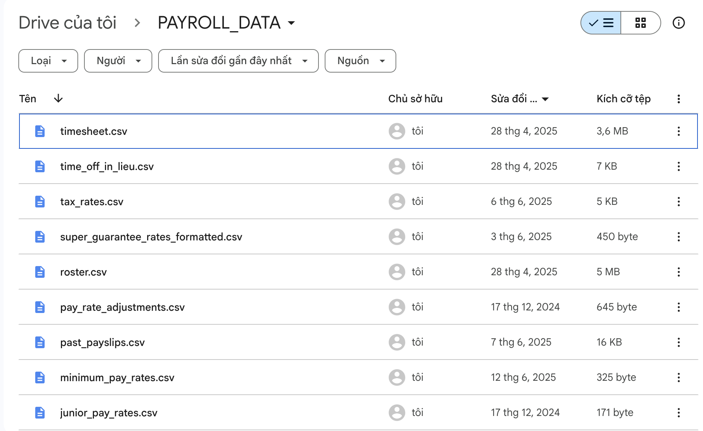
   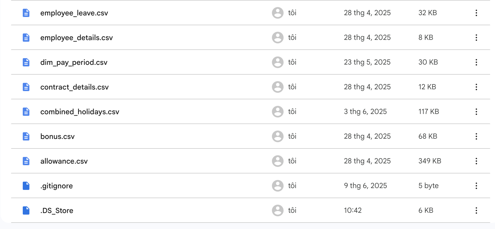
    </br>
</p>

### Apache Airflow
Orchestrates ETL workflows for payroll data processing.

<p align="center">
    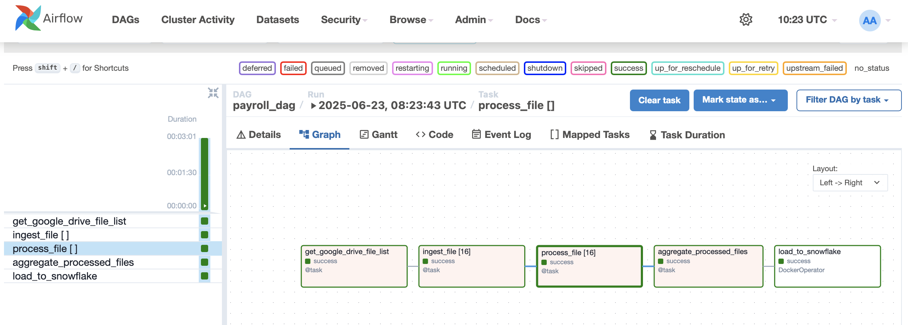
    </br>
  Airflow overview
</p>

- Building and running Airflow with Docker
```shell
cd docker/spark-app
docker build . -t spark-app
cd ../../
docker compose up -d --build
```

- Install providers:
```shell
uv pip install apache-airflow-providers-slack httpfs
```

- Setup connections in Airflow UI for Slack, Snowflake, and AWS.
  
<p align="center">
    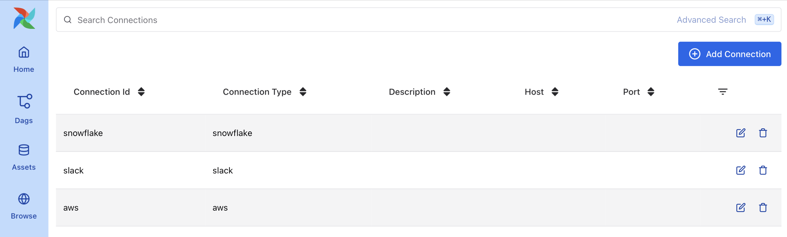
    </br>
  Airflow connection overview
</p>

### DuckDB
Used for lightweight data transformation and analytics at the data lake layer.

### Amazon S3

- Setup IAM for the Payroll System on Amazon S3.  
It includes roles, permissions, and policies that ensure secure access control.
  
<p align="center">
    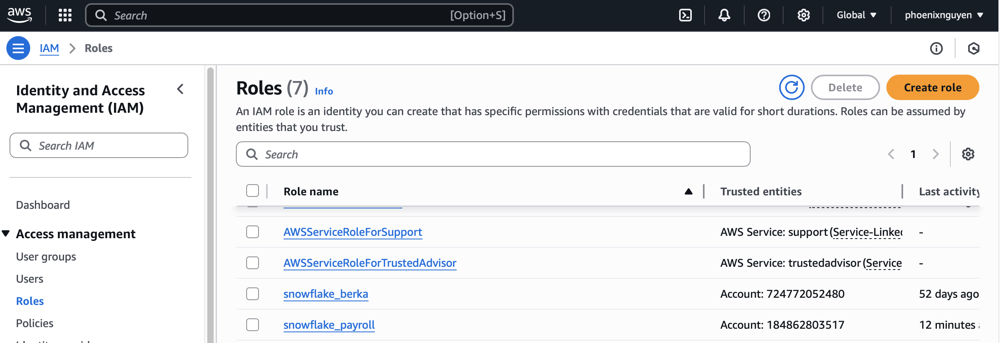
    </br>
  Amazon IAM
</p>

- Data Lake: Raw Folder 
  
<p align="center">
    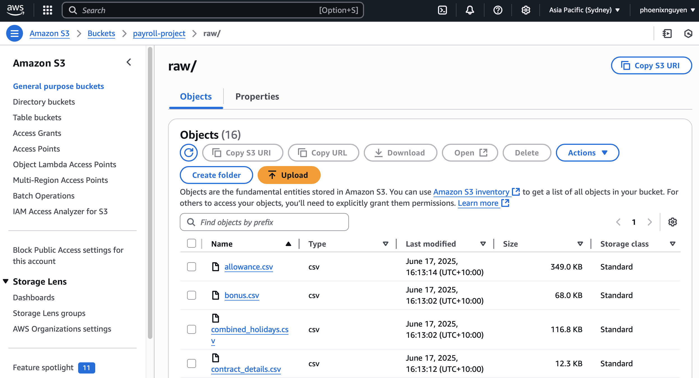
    </br>
</p>

- Data Lake: Processed Folder

<p align="center">
    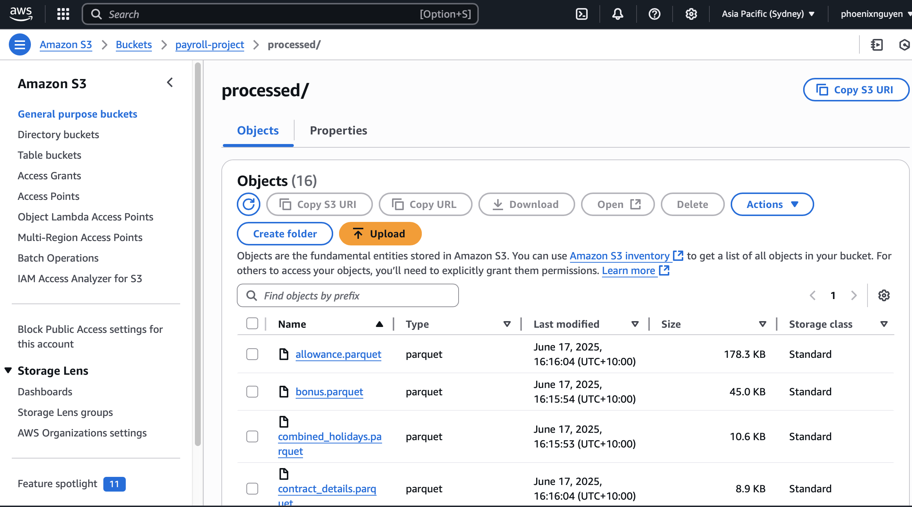
</p>

### Snowflake

- Data Warehouse
  For Snowflake setup, follow instructions in snowflake-setup.md
  
<p align="center">
    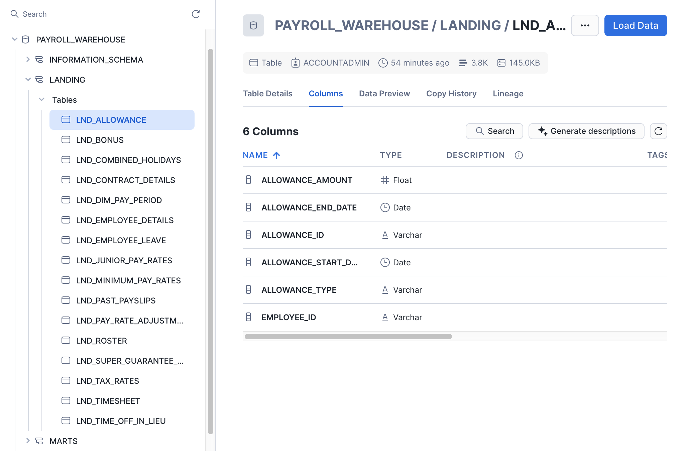
    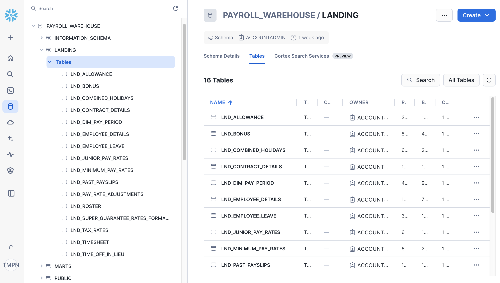
  </br>
</p>
<p align="center">
    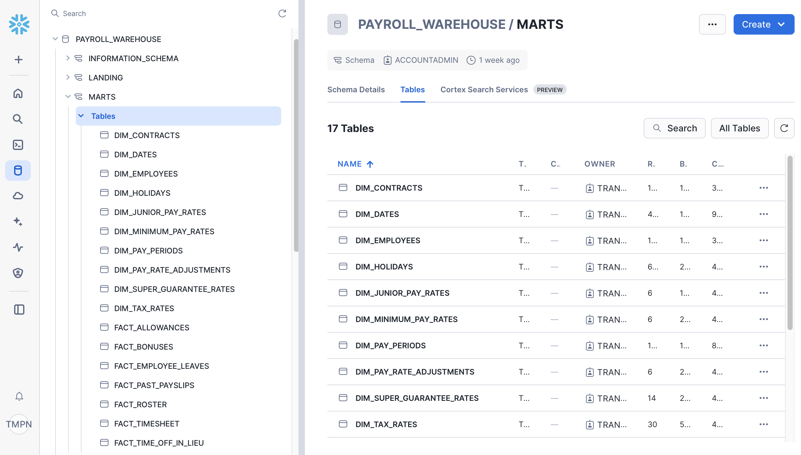
    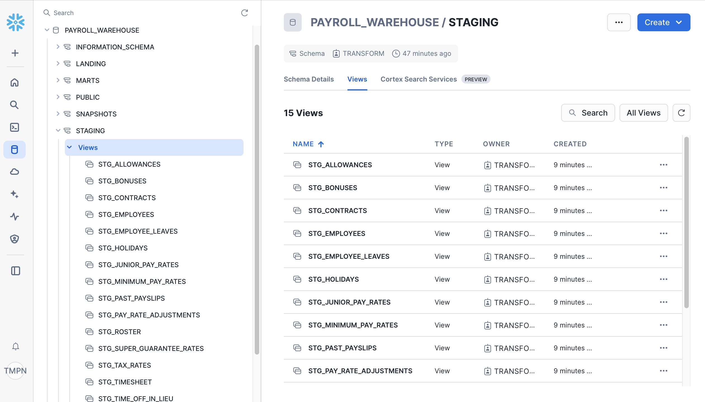
  </br>
</p>
<p align="center">
     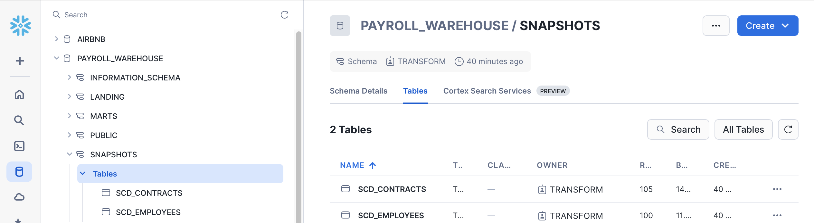
  </br>
</p>
  
### dbt & Great Expectations
dbt (Data Build Tool) is used to transform raw data into analytics-ready, modeled datasets, manage version control, automate SQL queries, and generate documentation. 
Great Expectations complements dbt by automating data quality checks, generating detailed reports, and integrating seamlessly for end-to-end validation.

- Setup & Run dbt:
  Configure `~/.dbt/profiles.yml` with your Snowflake account:
```shell
dbt_payroll:
  outputs:
    staging:
      account: "{{ env_var('SNOWFLAKE_ACCOUNT') }}"
      database: "{{ env_var('SNOWFLAKE_DATABASE') }}"
      password: "{{ env_var('DBT_PASSWORD') }}"
      role: "{{ env_var('DBT_ROLE') }}"
      schema: staging
      threads: 20
      type: snowflake
      user: "{{ env_var('DBT_USER') }}"
      warehouse: COMPUTE_WH
  target: staging
```

dbt commands: 
```shell
uv pip install dbt-core dbt-duckdb
```

- cd to dbt_payroll
```shell
dbt debug       /* Check configuration */ 
dbt deps        /* Download dependent packages (if any) */  
dbt seed        /* Load CSV seed data into DuckDB */ 
dbt compile     /* Compile SQL models without running them */ 
dbt run         /* Run all models to build tables/views */ 
dbt snapshot    /* Execute snapshots to capture state changes over time */ 
dbt test        /* Run data tests to validate data quality */ 
```

Generate and serve documentation for your dbt models and data quality checks:
```shell
dbt docs generate
dbt docs serve
```

- View lineage graphs of your transformations to understand dependencies:

<p align="center">
    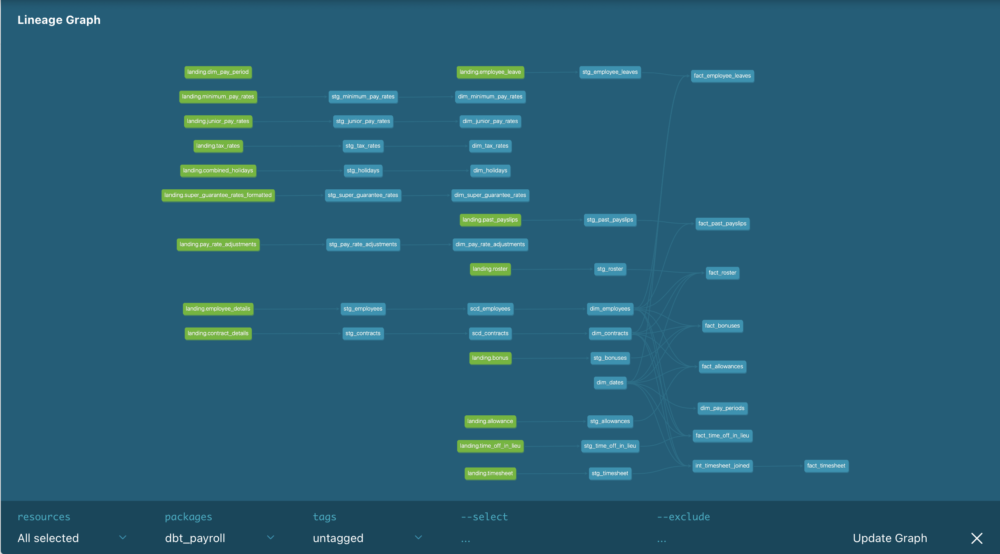
    </br>
  dbt overview
</p>

<p align="center">
  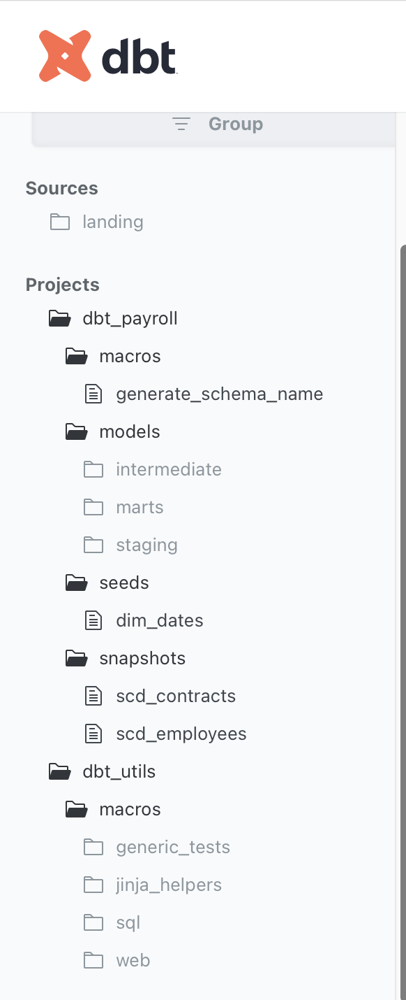
  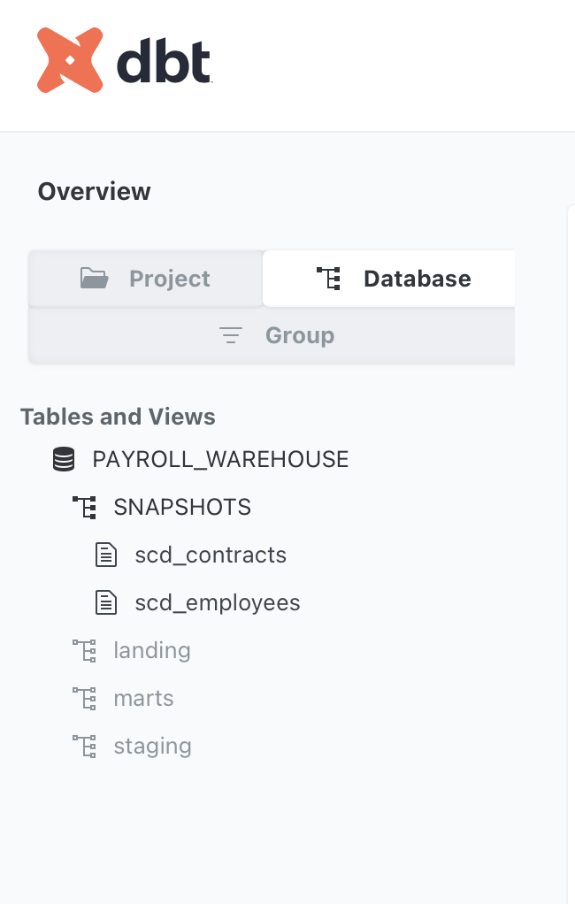
</p>

### PowerBI
For dashboarding and visualization of payroll analytics.
<p align="center">
    
    </br>
  PowerBI overview
</p>

## Business Insights

Once the pipeline is operational, you can generate insights such as:

### Payroll Overview
- Total payroll expenses by month, department, or location.
- Trends in salary, overtime, and deductions.

### Recommendations
- Optimize payroll schedules to improve cash flow.
- Target retention strategies for key employee segments.
- Automate compliance checks to reduce audit risks.


